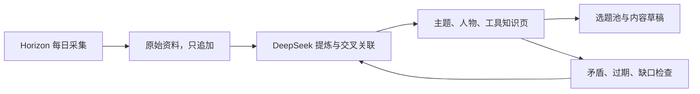

# 我的 AI 知识库

这是一套面向 AI 博主的 Obsidian 知识系统。它不是资料仓库，而是一条会持续积累的内容生产链：

## 快速开始

1. 在 Obsidian 中选择“打开本地仓库”。
2. 选择本目录 `knowledge-base`。
3. 从 [[首页]] 开始浏览。
4. 把文章链接或临时想法放进 `01-收件箱`，或者直接对 Codex 说“把这个链接录入知识库”。
5. 从 [[选题池]] 挑选适合发布的内容。

## 自动迭代

GitHub Actions 每天北京时间 09:10 执行一次：

1. 读取 Horizon 中文 Atom Feed。
2. 保存未处理日报到不可覆盖的原始资料层。
3. 调用 DeepSeek 更新知识页、关联和自动选题。
4. 重建索引、追加日志并执行链接健康检查。
5. 将结果提交回仓库，Git 历史就是回滚与审计记录。

系统允许自动更新知识内容，但不会自动修改 `AGENTS.md`。涉及分类法、写作原则或自动化边界的改变，只会保存到“规则提案”，等待人工确认。

## 目录说明

| 目录 | 作用 | 谁可以写 |
| --- | --- | --- |
| `00-导航` | 首页、使用说明、知识地图 | 人和 AI |
| `01-收件箱` | 待处理资料与规则提案 | 人和 AI |
| `02-原始资料` | 来源快照与证据，只追加 | 自动流程 |
| `03-知识库` | 主题、人物、机构、工具、方法 | AI 维护，人审核 |
| `04-内容工厂` | 选题、草稿和已发布内容 | 人和 AI |
| `05-系统` | 索引、来源登记、日志、健康报告 | 自动流程 |
| `09-模板` | 新建笔记模板 | 人维护 |
| `scripts` | 自动迭代和质量检查 | 人审核后修改 |

## 三条底线

- 事实必须能回到原始链接；推断和观点必须明确标注。
- 原始资料不覆盖，旧结论不静默删除；出现冲突时并列记录。
- 自动化可以改知识，不能偷偷改自己的规则。
